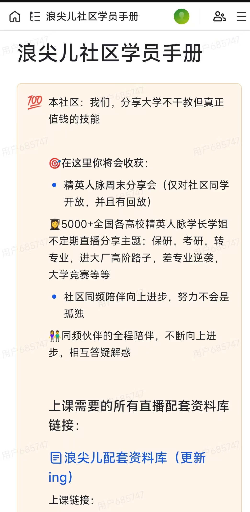

# RST 竞赛训练营 · 入营筛选赛题提交

**作者：杨豫豪（YYH）**
**学校 / 专业：河南城建学院 · 环境工程专业（2026级）**
**联系方式：177 1989 1195 ｜ 2813573523@qq.com ｜ 河南郑州**

---

# 附加题：坦克大战小游戏

## 🌐 在线试玩（已部署上线）

https://sweet-sunshine-cd0b26.netlify.app/tank-game.html

## 📁 文件结构

```
├── tank-game.html    坦克大战（Canvas 实现，双击即可离线运行）
├── bg.jpg            底图素材：浪尖儿大学生社区学员手册（底图加分）
├── lucide.js         商店界面图标库（项目自托管，仓库现有资源）
└── README.md         本说明文档（文末附 tank-game.html 完整源代码）
```

## ✅ 完成情况

- **开局规则确认**：先展示完整规则（目标/耐久/血量/操作/敌军行为/BOSS/道具/商店），
  玩家确认后才开局；
- **自选坦克**：轻型·猎豹（高机动）/ 标准·战狼（均衡）/ 重型·堡垒（双倍伤害）；
- **8 个关卡 + BOSS 战**：第 4、8 关为 BOSS 战（巨型坦克：厚血、三连发散射、
  撞碎砖墙，顶部专属血条）；每关开始生命重置为 3 条、营地修复 +2；
- **随机道具**：⭐火力+1 / 🔧营地修理 / 🛡️无敌 6 秒 / ❄️冻结敌军 5 秒 /
  💣全屏爆破 / 🪙金币+80——定时刷新 + 击杀 25% 掉落，走过去拾取；
- **金币商店**：击杀 +10、通关奖励（100 + 关卡×20 + 剩余生命×20），
  可购火力/移速/射速/血量上限/生命/营地加固/钢墙护营（强化营地与坦克）；
- **通关反馈与失败鼓励**：通关展示击杀数与奖励并附夸奖文案；
  失败随机鼓励语（"别灰心，营地的砖还热乎着……"）；
- **营地 7 发耐久（每局重置）**：血条 + ❤ 实时显示，归零即失败；
  我方每命 3 发血量、3 条生命；
- **敌军 AI 进攻营地**：沿距离场寻路推进、炮轰挡路砖墙开路、
  与营地或玩家对齐时优先开火；
- **打击感**：屏幕震动、枪口火光、爆炸冲击环、命中白闪、击毁飘分、
  WebAudio 合成音效（零素材）；
- 【身份标识】地图中央砖墙摆成姓名缩写「YYH」+ 画布右下角「杨豫豪 · YYH」水印；
- 【底图加分】底图采用「浪尖儿大学生社区」学员手册素材，游戏内显示社区名称。

## 🗺️ 源代码导读（tank-game.html）

| 部分 | 内容 |
|---|---|
| `TANK_TYPES / FOE_TYPES` | 3 种我方坦克、3 种敌军兵种的属性表 |
| `LEVELS / LEVEL_WALLS` | 8 关配置（第 4、8 关 `boss:true`）与每关障碍布局 |
| `ITEM_TYPES / SHOP` | 6 种道具与 7 种商店商品的配置表 |
| `buildMap()` + `GLYPH` | 地图构建；中央砖墙按字形矩阵摆出「YYH」 |
| `computeDist()` | 以营地为源点的距离场（Dijkstra，砖墙代价 6），供敌军/BOSS 寻路 |
| `enemyThink() / bossThink()` | 敌军 AI：进攻营地、拆墙开路、对齐开火；BOSS 三连发与撞墙 |
| `spawnItem() / applyItem()` | 道具刷新（定时+击杀掉落）与拾取生效 |
| `renderShop() / buy()` | 商店渲染（lucide 图标）与购买逻辑 |
| `step()` | 主循环：移动、炮弹、碰撞、道具、冻结、胜负判定 |
| `draw()` | 绘制：底图、墙体、社区标识、道具、坦克、BOSS 血条、特效 |
| `S.*` | WebAudio 合成音效（开火/爆炸/道具/金币/BOSS/胜负） |

---

## 📖 tank-game.html 完整源代码

```html
<!DOCTYPE html>
<html lang="zh-CN">
<head>
<meta charset="UTF-8">
<meta name="viewport" content="width=device-width, initial-scale=1.0">
<title>坦克大战 · YYH | 杨豫豪</title>
<!--
  ============================================================
  RST 竞赛训练营 · 附加题：坦克大战 v3
  作者：杨豫豪（YYH）  河南城建学院 · 环境工程
  说明：HTML5 Canvas + JavaScript 实现，图标使用项目内自托管
        lucide.js（仓库现有资源），其余素材零外部依赖。
  【身份标识】地图中央砖墙摆成姓名缩写「YYH」，
             画布右下角亦有「杨豫豪 · YYH」水印。
  【玩法特性】主界面 + 双模式（闯关 15 关 / 生存无尽）/
             闯关每 4 关 BOSS / 金币全局持久化（输了也能永久升级）/
             永久升级系统 + 生存里程碑奖励 + 永久「黄金徽章」buff /
             随机道具 / 金币商店 / 守护×3 时间倒流 / 打击感与音效。
  【底图加分】底图采用「浪尖儿大学生社区」学员手册素材（bg.jpg）。
  ============================================================
-->
<style>
  *{margin:0;padding:0;box-sizing:border-box}
  body{min-height:100vh;display:flex;flex-direction:column;align-items:center;
    justify-content:center;gap:14px;padding:20px;
    font-family:"PingFang SC","Microsoft YaHei",sans-serif;
    background:linear-gradient(160deg,#0e1513,#14231e);color:#e8f1ed}
  h1{font-size:24px;letter-spacing:4px}
  h1 span{color:#2fd397}
  .hud{display:flex;gap:16px;font-size:14px;color:#9db4ab;flex-wrap:wrap;justify-content:center}
  .hud b{color:#2fd397;font-size:16px;margin-left:6px}
  #baseHp{color:#ff7a6e;letter-spacing:2px}
  #hp{color:#ff7a6e}
  #coins{color:#ffd666}
  #mode{color:#7dd3fc}
  .stage{position:relative}
  canvas{border-radius:12px;box-shadow:0 14px 40px rgba(0,0,0,.5);
    max-width:96vw;height:auto;background:#0a0f0d;display:block}
  .tips{font-size:13px;color:#9db4ab;text-align:center;line-height:1.9}
  kbd{background:#1c2b26;border:1px solid #2a3d35;border-radius:6px;
    padding:1px 8px;font-size:12px;color:#2fd397}
  /* ---------- 通用面板 ---------- */
  .panel{position:absolute;inset:0;z-index:50;border-radius:12px;
    display:flex;flex-direction:column;gap:14px;align-items:center;justify-content:center;
    background:rgba(5,12,10,.9);backdrop-filter:blur(4px);padding:20px}
  .panel h2{font-size:22px;letter-spacing:4px;color:#2fd397}
  .panel .sub{font-size:13px;color:#9db4ab;text-align:center;line-height:1.7}
  .panel .coins{font-size:16px;color:#ffd666}
  .panel .coins b{font-size:22px}
  .menuBtn{background:#182420;border:1px solid #2a3d35;border-radius:14px;
    color:#e8f1ed;padding:16px 40px;font-size:17px;font-weight:700;letter-spacing:2px;
    cursor:pointer;transition:.15s;min-width:260px;text-align:center}
  .menuBtn:hover{transform:translateY(-3px);border-color:#2fd397;box-shadow:0 8px 24px rgba(0,0,0,.4)}
  .menuBtn .tag{display:block;font-size:12px;color:#9db4ab;font-weight:400;margin-top:4px}
  .menuBtn.small{padding:11px 26px;font-size:14px;min-width:0}
  .back{background:transparent;border:1px solid #2a3d35;color:#9db4ab;border-radius:999px;
    padding:9px 24px;font-size:13px;cursor:pointer;transition:.15s}
  .back:hover{color:#2fd397;border-color:#2fd397}
  /* ---------- 规则面板 ---------- */
  #rulesPanel ul{list-style:none;max-width:620px;max-height:66%;overflow-y:auto;
    display:flex;flex-direction:column;gap:8px;font-size:13px;color:#c8d8d0;line-height:1.65}
  #rulesPanel li{background:rgba(24,36,32,.7);border:1px solid #2a3d35;
    border-radius:10px;padding:7px 14px;text-align:left}
  .pri{background:#2fd397;color:#0e1513;border:none;border-radius:999px;
    padding:12px 34px;font-size:16px;font-weight:700;letter-spacing:2px;cursor:pointer;transition:.2s}
  .pri:hover{transform:scale(1.05);box-shadow:0 0 20px rgba(47,211,151,.4)}
  /* ---------- 坦克选择 ---------- */
  .tks{display:flex;gap:14px;flex-wrap:wrap;justify-content:center;padding:0 12px}
  .tk{width:170px;background:#182420;border:1px solid #2a3d35;border-radius:14px;
    padding:18px 14px;text-align:center;cursor:pointer;transition:.2s}
  .tk:hover{transform:translateY(-4px);border-color:var(--c,#2fd397);box-shadow:0 8px 24px rgba(0,0,0,.4)}
  .tk .ico{font-size:38px}
  .tk h3{color:var(--c,#2fd397);margin:10px 0 6px;font-size:16px}
  .tk p{font-size:12px;color:#9db4ab;line-height:1.8}
  .tk .key{margin-top:10px;font-size:11px;color:#5a6f68}
  /* ---------- 商店 / 升级 ---------- */
  .goods{display:grid;grid-template-columns:repeat(auto-fit,minmax(150px,1fr));
    gap:10px;max-width:720px;width:100%;max-height:46%;overflow-y:auto;padding:2px}
  .good{background:#182420;border:1px solid #2a3d35;border-radius:12px;
    padding:12px 10px;text-align:center;cursor:pointer;transition:.15s;color:#e8f1ed}
  .good:hover:not(.off){border-color:#2fd397;transform:translateY(-2px)}
  .good.off{opacity:.42;cursor:not-allowed}
  .good svg{width:22px;height:22px;color:#2fd397}
  .good h4{font-size:14px;margin:6px 0 4px}
  .good p{font-size:11px;color:#9db4ab;line-height:1.6;min-height:32px}
  .good .cost{margin-top:6px;font-size:13px;color:#ffd666;font-weight:700}
  .hide{display:none!important}
  /* ---------- 移动端虚拟按键 ---------- */
  .pad{display:none;gap:40px;margin-top:4px}
  .pad .dir{display:grid;grid-template-columns:repeat(3,52px);grid-template-rows:repeat(3,52px);gap:6px}
  .pad button{border:1px solid #2a3d35;background:#182420;color:#2fd397;
    border-radius:10px;font-size:20px;touch-action:none;user-select:none}
  .pad .fire{width:72px;height:72px;border-radius:50%;align-self:center;font-size:16px}
  @media (pointer:coarse){.pad{display:flex}.tips .pc{display:none}}
</style>
</head>
<body>

<h1>坦克大战 <span>YYH</span></h1>
<div class="hud">
  <div>模式<b id="mode">—</b></div>
  <div>关卡<b id="lv">1</b></div>
  <div>生命<b id="lives">3</b></div>
  <div>血量<b id="hp">❤❤❤</b></div>
  <div>剩余敌军<b id="foes">0</b></div>
  <div>得分<b id="score">0</b></div>
  <div>金币<b id="coins">🪙0</b></div>
  <div>营地耐久<b id="baseHp">❤❤❤❤❤❤❤</b></div>
  <div>守护<b id="guards">×3</b></div>
</div>

<div class="stage">
  <canvas id="game" width="960" height="600"></canvas>
  

  <!-- 主界面 -->
  <div id="menuPanel" class="panel">
    <h2>坦克大战 YYH</h2>
    <div class="sub">守住营地 🏫，歼灭敌军 · 金币全局累计，输了也能永久变强</div>
    <div class="coins">🪙 我的金币：<b id="menuCoins">0</b></div>
    <button class="menuBtn" id="btnCampaign">⚔️ 闯关模式<span class="tag">15 关 · 每 4 关一个 BOSS</span></button>
    <button class="menuBtn" id="btnSurvival">♾️ 生存模式<span class="tag">无尽波次 · 生存越久金币越多 · 20 天解锁永久 buff</span></button>
    <button class="menuBtn" id="btnUpgrade">🔧 永久升级<span class="tag">用金币永久强化坦克与营地</span></button>
    <button class="menuBtn small" id="btnRules">📖 游戏规则</button>
  </div>

  <!-- 永久升级面板 -->
  <div id="upgradePanel" class="panel hide">
    <h2>永久升级</h2>
    <div class="sub">永久生效于所有模式，输了也保留 —— 强化你的坦克与营地</div>
    <div class="coins">🪙 我的金币：<b id="upCoins">0</b></div>
    <div class="goods" id="upGoods"></div>
    <button class="back" id="btnUpBack">← 返回主界面</button>
  </div>

  <!-- 规则面板 -->
  <div id="rulesPanel" class="panel hide">
    <h2>游戏规则</h2>
    <ul>
      <li>🎯 <b>目标</b>：守住底部营地 🏫，歼灭每关全部敌军</li>
      <li>🏫 <b>营地耐久</b>：最多承受 7 发炮弹（每局重置），归零触发「守护·时间倒流」</li>
      <li>❤️ <b>我方血量</b>：每条命 3 发，共 3 条生命；每关开始生命重置</li>
      <li>🕹️ <b>操作</b>：WASD / 方向键移动，空格开炮（手机用屏幕虚拟按键）</li>
      <li>🤖 <b>敌军</b>：从顶部三个出生门传送入场；多数打营地，头带红标的「猎手」追杀你</li>
      <li>👹 <b>BOSS</b>（闯关）：第 4 / 8 / 12 / 15 关单挑巨型坦克，击毁大量金币</li>
      <li>🎁 <b>道具</b>：⭐火力 🔧修理 🛡️无敌 ❄️冻结 💣爆破 🪙金币 ❤️加命 ⚡速射</li>
      <li>🛒 <b>商店</b>：每关通关后可用金币强化（本局内生效）</li>
      <li>🔧 <b>永久升级</b>：主界面的永久升级对所有模式生效，输了金币仍在</li>
      <li>♾️ <b>生存模式</b>：波次越后越难，金币越多；5 天 +200、10 天 +500、20 天 +2000 并解锁永久 buff「黄金徽章」</li>
      <li>🕒 <b>守护·时间倒流</b>：营地 3 次守护，失守时时间暂停、敌军回退、营地满血</li>
    </ul>
    <button class="pri" id="rulesOk">返回主界面</button>
  </div>

  <!-- 坦克选择面板 -->
  <div id="selectPanel" class="panel hide">
    <h2>选择你的坦克</h2>
    <div class="sub" id="selectSub">选择坦克出击</div>
    <div class="tks">
      <div class="tk" style="--c:#2fd397" data-t="0">
        <div class="ico">🐆</div><h3>轻型 · 猎豹</h3>
        <p>移速 ★★★<br>射速 ★★★<br>弹速 ★★★<br>机动游击型</p>
        <div class="key">按 1 选择</div>
      </div>
      <div class="tk" style="--c:#3fb6e0" data-t="1">
        <div class="ico">⚔️</div><h3>标准 · 战狼</h3>
        <p>移速 ★★☆<br>射速 ★★☆<br>弹速 ★★☆<br>均衡全能型</p>
        <div class="key">按 2 选择</div>
      </div>
      <div class="tk" style="--c:#e8b93e" data-t="2">
        <div class="ico">🛡️</div><h3>重型 · 堡垒</h3>
        <p>移速 ★☆☆<br>射速 ★☆☆<br>伤害 ★★★（双倍）<br>攻坚碾压型</p>
        <div class="key">按 3 选择</div>
      </div>
    </div>
    <div class="sub">地图中央砖墙为本人姓名缩写「YYH」—— 杨豫豪 原创</div>
  </div>

  <!-- 商店面板（每关通关后打开） -->
  <div id="shopPanel" class="panel hide">
    <h2 id="shopTitle">🎉 第 1 关通过！</h2>
    <div class="sub" id="shopStats"></div>
    <div class="coins">🪙 我的金币：<b id="shopCoins">0</b></div>
    <div class="goods" id="goods"></div>
    <button class="pri" id="shopNext">进入下一关 ▶</button>
  </div>
</div>

<div class="tips">
  <span class="pc">移动：<kbd>W</kbd><kbd>A</kbd><kbd>S</kbd><kbd>D</kbd> / 方向键 &nbsp;·&nbsp; 开炮：<kbd>空格</kbd> &nbsp;·&nbsp; 确认/继续：<kbd>回车</kbd> &nbsp;·&nbsp; 选坦克：<kbd>1</kbd><kbd>2</kbd><kbd>3</kbd></span><br>
  拾取场上道具能帮你守住营地；通关记得去商店消费，主界面可永久升级！
</div>
<div class="pad">
  <div class="dir">
    <span></span><button data-k="up">▲</button><span></span>
    <button data-k="left">◀</button><span></span><button data-k="right">▶</button>
    <span></span><button data-k="down">▼</button><span></span>
  </div>
  <button class="fire" data-k="fire">开炮</button>
</div>

<script src="lucide.js"></script>
<script>
/* ================= 基础常量 ================= */
const CV=document.getElementById('game'),CX=CV.getContext('2d');
const CELL=40,COLS=24,ROWS=15;                 // 24x15 网格，960x600 横版宽屏
const EMPTY=0,BRICK=1,STEEL=2;
const DIRS={up:[0,-1],down:[0,1],left:[-1,0],right:[1,0]};
const ENEMY_DIRS=['up','down','left','right'];
const BASE_DEFAULT_HP=7;                       // 营地初始耐久：7 发炮弹
const CAMPAIGN_LEVELS=15;                      // 闯关模式 15 关

/* ================= 永久进度（localStorage 持久化） ================= */
const LS=(typeof localStorage!=='undefined')?localStorage:null;
function blankMeta(){return {coins:0,perm:{dmg:0,speed:0,cool:0,hp:0,base:0},buff:false}}
function loadMeta(){try{const m=JSON.parse(LS&&LS.getItem('yyh-meta')||'null');return m||blankMeta()}catch(e){return blankMeta()}}
function saveMeta(){try{LS&&LS.setItem('yyh-meta',JSON.stringify(meta))}catch(e){}}
let meta=loadMeta();
function goldMul(){return meta.buff?1.15:1}    // 黄金徽章：金币 +15%
function gainCoins(n){coins+=Math.round(n*goldMul());meta.coins=coins;saveMeta()}
function spendCoins(n){coins-=n;meta.coins=coins;saveMeta()}

/* ================= 永久升级商品 ================= */
const PERM=[
  {id:'dmg', ico:'swords',name:'火力 +1',  desc:'永久伤害 +1（最多 +3）',     base:300,step:1.5,max:3},
  {id:'speed',ico:'zap',   name:'移速 +8%', desc:'永久移速提升（最多 +5）',     base:200,step:1.4,max:5},
  {id:'cool', ico:'timer', name:'射速 +8%', desc:'永久射速提升（最多 +5）',     base:220,step:1.4,max:5},
  {id:'hp',   ico:'heart', name:'血量上限 +1',desc:'永久血量上限 +1（最多 +2）', base:260,step:1.6,max:2},
  {id:'base', ico:'castle',name:'营地耐久 +1',desc:'永久营地耐久 +1（最多 +3）', base:280,step:1.6,max:3}
];
function permCost(it){return Math.round(it.base*Math.pow(it.step,meta.perm[it.id]||0))}

/* ================= 坦克类型（开局可选） ================= */
const TANK_TYPES=[
  {name:'轻型 · 猎豹',color:'#2fd397',speed:3.0,cool:12,bspeed:9, dmg:1},
  {name:'标准 · 战狼',color:'#3fb6e0',speed:2.2,cool:18,bspeed:6.5,dmg:1},
  {name:'重型 · 堡垒',color:'#e8b93e',speed:1.5,cool:30,bspeed:5.5,dmg:2}
];
/* ================= 敌军类型 ================= */
const FOE_TYPES={
  basic:{hp:1,sp:1.3, color:'#e05a4e',score:100},
  fast: {hp:1,sp:2.3, color:'#e08a3e',score:150},
  armor:{hp:3,sp:0.95,color:'#a06ae0',score:300}
};
/* ================= 闯关关卡配置（15 关，每 4 关 BOSS） ================= */
const LEVELS=[
  {total:6, alive:3,mix:['basic','basic','basic'],       rate:1.00},
  {total:8, alive:4,mix:['basic','basic','fast'],        rate:1.08},
  {total:10,alive:4,mix:['basic','fast','armor'],        rate:1.16},
  {total:0, alive:0,mix:[],rate:1.15,boss:true,bossHp:20,bossSp:0.8},
  {total:12,alive:5,mix:['fast','basic','armor','armor'],rate:1.24},
  {total:12,alive:5,mix:['fast','armor','armor'],        rate:1.30},
  {total:14,alive:5,mix:['armor','fast','armor','fast'], rate:1.36},
  {total:0, alive:0,mix:[],rate:1.30,boss:true,bossHp:28,bossSp:0.9},
  {total:14,alive:6,mix:['armor','fast','armor','fast'], rate:1.42},
  {total:16,alive:6,mix:['armor','fast','armor','armor'],rate:1.48},
  {total:16,alive:6,mix:['fast','fast','armor','armor'], rate:1.54},
  {total:0, alive:0,mix:[],rate:1.40,boss:true,bossHp:34,bossSp:1.0},
  {total:18,alive:6,mix:['armor','fast','armor','fast'], rate:1.60},
  {total:18,alive:6,mix:['armor','armor','fast','fast'], rate:1.66},
  {total:0, alive:0,mix:[],rate:1.50,boss:true,bossHp:40,bossSp:1.1}
];
/* 每关额外障碍（YYH 中央布局保持不变，只调整外围） */
const LEVEL_WALLS=[
  {steel:[[4,3],[19,3],[4,10],[19,10]],brick:[]},
  {steel:[[4,3],[19,3],[4,10],[19,10]],brick:[[3,6],[4,6],[19,6],[20,6],[11,3],[12,3]]},
  {steel:[[4,3],[19,3],[4,10],[19,10],[11,2],[12,2]],brick:[[3,6],[4,6],[19,6],[20,6],[6,11],[17,11]]},
  {steel:[[4,3],[19,3],[4,10],[19,10]],brick:[[7,2],[8,2],[15,2],[16,2]]},
  {steel:[[4,3],[19,3],[4,10],[19,10],[1,7],[22,7]],brick:[[7,2],[8,2],[15,2],[16,2],[11,11],[12,11]]},
  {steel:[[4,3],[19,3],[4,10],[19,10],[11,3],[12,3]],brick:[[3,6],[4,6],[19,6],[20,6],[6,11],[17,11]]},
  {steel:[[4,3],[19,3],[4,10],[19,10],[1,7],[22,7]],brick:[[3,6],[4,6],[19,6],[20,6],[6,11],[7,11],[16,11],[17,11]]},
  {steel:[[4,3],[19,3],[4,10],[19,10],[11,2],[12,2]],brick:[[3,6],[4,6],[19,6],[20,6]]},
  {steel:[[4,3],[19,3],[4,10],[19,10],[11,2],[12,2]],brick:[[3,6],[4,6],[19,6],[20,6],[6,11],[17,11]]},
  {steel:[[4,3],[19,3],[4,10],[19,10],[1,7],[22,7]],brick:[[7,2],[8,2],[15,2],[16,2],[11,11],[12,11]]},
  {steel:[[4,3],[19,3],[4,10],[19,10]],brick:[[2,6],[3,6],[20,6],[21,6],[9,3],[14,3],[6,11],[17,11]]},
  {steel:[[4,3],[19,3],[4,10],[19,10],[11,3],[12,3]],brick:[[3,6],[4,6],[19,6],[20,6]]},
  {steel:[[4,3],[19,3],[4,10],[19,10]],brick:[[2,6],[3,6],[20,6],[21,6],[5,11],[6,11],[17,11],[18,11]]},
  {steel:[[4,3],[19,3],[4,10],[19,10],[1,7],[22,7]],brick:[[6,2],[7,2],[16,2],[17,2],[9,11],[14,11]]},
  {steel:[[4,3],[19,3],[4,10],[19,10]],brick:[[3,6],[4,6],[19,6],[20,6],[9,3],[14,3],[6,11],[17,11]]}
];
/* 生存模式：波次越后越难 */
function survivalCfg(w){
  return {
    total:5+w*2, alive:Math.min(3+w,8),
    mix:w<2?['basic','basic','fast']:w<4?['basic','fast','armor']:w<7?['fast','armor','armor']:['armor','fast','armor','fast'],
    rate:Math.min(1+w*0.06,2.2), boss:false
  };
}
function levelCfg(){return mode==='survival'?survivalCfg(level):(LEVELS[level-1]||LEVELS[LEVELS.length-1])}

/* ================= 道具类型（badge 徽章式图标 + 两字作用标签） ================= */
const ITEM_TYPES={
  star:  {ico:'⭐',label:'火力',c1:'#ffd666',c2:'#b8860b'},
  repair:{ico:'🔧',label:'修理',c1:'#5eead4',c2:'#0e9f6e'},
  shield:{ico:'🛡️',label:'无敌',c1:'#7dd3fc',c2:'#0b7fab'},
  freeze:{ico:'❄️',label:'冻结',c1:'#e0f2fe',c2:'#38bdf8'},
  bomb:  {ico:'💣',label:'爆破',c1:'#fca5a5',c2:'#dc2626'},
  coin:  {ico:'🪙',label:'金币',c1:'#fde68a',c2:'#d97706'},
  life:  {ico:'❤️',label:'加命',c1:'#fda4af',c2:'#e11d48'},
  rapid: {ico:'⚡',label:'速射',c1:'#fde047',c2:'#ca8a04'}
};
const ITEM_KEYS=Object.keys(ITEM_TYPES);
/* ================= 局内商店商品 ================= */
const SHOP=[
  {id:'dmg',  ico:'swords',    name:'火力 +1',   desc:'本局伤害 +1（最多 +2）',        cost:200,max:2},
  {id:'speed',ico:'zap',       name:'移速 +15%', desc:'本局移速提升（可叠 3 次）',      cost:120,max:3},
  {id:'cool', ico:'timer',     name:'射速 +15%', desc:'本局射速提升（可叠 3 次）',      cost:150,max:3},
  {id:'hp',   ico:'heart',     name:'血量上限 +1',desc:'每条命多扛 1 发（最多 +2）',    cost:150,max:2},
  {id:'life', ico:'heart-pulse',name:'生命 +1',  desc:'立即增加 1 条生命',             cost:160,max:99},
  {id:'base', ico:'castle',    name:'营地加固 +2',desc:'营地耐久上限 +2 并修复 2 点',   cost:180,max:3},
  {id:'wall', ico:'shield',    name:'钢墙护营',  desc:'下一关营地保护墙变为钢墙（一次性）',cost:130,max:1}
];
/* ================= 文案 ================= */
const PRAISES=['漂亮！营地毫发无损靠的就是你这手感！','干净利落！敌军根本没摸清你的套路！',
  '这波操作可以给满分！','稳！营地上的国旗因你而飘扬！'];
const CHEERS=['别灰心！营地的砖还热乎着，再来一局一定能守住！','失败是成功他妈，调整策略再冲一次！',
  '差一点点！下次记得在商店优先加固营地！','好汉不吃眼前亏，换个坦克类型试试？',
  '金币都攒着呢，去主界面永久升级一下再战！'];

/* ================= 地图构建 =================
   中央砖墙摆出姓名缩写「YYH」（5 行高，共 11 列宽，居中于第 6~16 列） */
const GLYPH={Y:['X.X','X.X','.X.','.X.','.X.'],H:['X.X','X.X','XXX','X.X','X.X']};
function buildMap(lv){
  const m=Array.from({length:ROWS},()=>Array(COLS).fill(EMPTY));
  for(let c=0;c<COLS;c++){m[0][c]=STEEL;m[ROWS-1][c]=STEEL}
  for(let r=0;r<ROWS;r++){m[r][0]=STEEL;m[r][COLS-1]=STEEL}
  const word=['Y','Y','H'];let col=6;
  for(const ch of word){
    GLYPH[ch].forEach((row,i)=>{[...row].forEach((v,j)=>{if(v==='X')m[5+i][col+j]=BRICK})});
    col+=4;
  }
  const prot=steelWallNext?STEEL:BRICK;
  [[10,12],[11,12],[12,12],[13,12],[10,13],[13,13]].forEach(([c,r])=>m[r][c]=prot);
  const w=LEVEL_WALLS[(lv-1)%LEVEL_WALLS.length];
  w.steel.forEach(([c,r])=>m[r][c]=STEEL);
  w.brick.forEach(([c,r])=>m[r][c]=BRICK);
  return m;
}
const BASE={x:11*CELL,y:13*CELL,w:2*CELL,h:CELL};   // 营地（底部中央，两格宽）
let baseHp=BASE_DEFAULT_HP,baseMaxHp=BASE_DEFAULT_HP,steelWallNext=false;
let map=buildMap(1);

/* ================= 底图：浪尖儿社区素材（bg.jpg，离屏绘制一次） ================= */
const BG=document.createElement('canvas');BG.width=CV.width;BG.height=CV.height;
function drawBackground(){
  const g=BG.getContext('2d');
  const img=document.getElementById('bgimg');
  if(img&&img.complete&&img.naturalWidth>0){
    const s=Math.max(960/img.naturalWidth,600/img.naturalHeight);
    const w=img.naturalWidth*s,h=img.naturalHeight*s;
    g.drawImage(img,(960-w)/2,(600-h)/2,w,h);
    g.fillStyle='rgba(5,12,10,.45)';g.fillRect(0,0,960,600);
  }else{
    const grad=g.createLinearGradient(0,0,0,600);
    grad.addColorStop(0,'#101c17');grad.addColorStop(1,'#0a120e');
    g.fillStyle=grad;g.fillRect(0,0,960,600);
  }
  g.strokeStyle='rgba(255,255,255,.045)';g.lineWidth=1;
  for(let x=0;x<=960;x+=CELL){g.beginPath();g.moveTo(x,0);g.lineTo(x,600);g.stroke()}
  for(let y=0;y<=600;y+=CELL){g.beginPath();g.moveTo(0,y);g.lineTo(960,y);g.stroke()}
}
drawBackground();
try{document.getElementById('bgimg').addEventListener('load',drawBackground)}catch(e){}

/* ================= 音效（WebAudio 合成，无外部素材） ================= */
let AC=null;
function ac(){if(!AC)AC=new (window.AudioContext||window.webkitAudioContext)();return AC}
function tone(f,d,type,v){
  try{const a=ac(),o=a.createOscillator(),g=a.createGain();o.type=type||'square';o.frequency.value=f;
    g.gain.setValueAtTime(v||.12,a.currentTime);g.gain.exponentialRampToValueAtTime(.001,a.currentTime+d);
    o.connect(g).connect(a.destination);o.start();o.stop(a.currentTime+d)}catch(e){}
}
function noise(d,v){
  try{const a=ac(),n=Math.floor(a.sampleRate*d),b=a.createBuffer(1,n,a.sampleRate),ch=b.getChannelData(0);
    for(let i=0;i<n;i++)ch[i]=(Math.random()*2-1)*(1-i/n);
    const s=a.createBufferSource();s.buffer=b;const g=a.createGain();g.gain.value=v||.3;
    s.connect(g).connect(a.destination);s.start()}catch(e){}
}
const S={
  shoot(){tone(520,.08,'square',.10)},hit(){tone(220,.05,'square',.10)},
  boom(){noise(.28,.30);tone(90,.25,'sawtooth',.18)},baseHit(){noise(.4,.35);tone(60,.4,'sawtooth',.25)},
  item(){tone(880,.1,'triangle',.15);setTimeout(()=>tone(1174,.12,'triangle',.15),90)},
  coin(){tone(1320,.07,'square',.10)},boss(){tone(70,.6,'sawtooth',.3);noise(.5,.3)},
  timeStop(){[0,160,320].forEach((t)=>setTimeout(()=>tone(1400,.06,'square',.20),t));
    setTimeout(()=>{tone(55,1.4,'sawtooth',.22);tone(82,1.4,'sawtooth',.14);noise(1.4,.16)},500)},
  rewind(){tone(200,.5,'sawtooth',.12);setTimeout(()=>tone(380,.5,'sawtooth',.12),130);setTimeout(()=>tone(560,.6,'sawtooth',.12),260)},
  win(){[523,659,784,1046].forEach((f,i)=>setTimeout(()=>tone(f,.18,'triangle',.15),i*140))},
  lose(){[400,300,200,120].forEach((f,i)=>setTimeout(()=>tone(f,.25,'sawtooth',.15),i*180))}
};

/* ================= 游戏状态 ================= */
let player,enemies,bullets,parts,rings,floats,items,keys,state,score,lives,foesTotal,spawnTimer,level,shake;
let boss=null,freezeT=0,itemTimer=0,coins=meta.coins,levelKills=0,overMsg='',pDistTimer=0;
let guards=3,rapidT=0,mode='campaign';
let rewindT=0,rewDur=0,rewindPlayer=null,rewindList=[];
let mods,bought;

function newPlayer(type){
  const t=TANK_TYPES[type];
  return {x:3*CELL,y:12*CELL,dir:'up',cool:0,type,
    speed:t.speed*mods.speedMul,bcool:Math.max(6,Math.round(t.cool*mods.coolMul)),
    bspeed:t.bspeed,dmg:t.dmg+mods.dmg,color:t.color,
    invT:0,shieldT:0,maxHp:mods.maxHp,hp:mods.maxHp};
}
function startGame(type,m){
  mode=m||'campaign';
  level=1;score=0;guards=3;rapidT=0;
  coins=meta.coins;                                // 金币不重置，输了仍在
  mods={dmg:meta.perm.dmg, speedMul:Math.pow(1.08,meta.perm.speed),
        coolMul:Math.pow(0.92,meta.perm.cool), maxHp:3+meta.perm.hp};
  bought={};
  baseMaxHp=BASE_DEFAULT_HP+meta.perm.base;baseHp=baseMaxHp;steelWallNext=false;
  lives=3+(meta.buff?1:0);                         // 黄金徽章：开局 +1 生命
  player=newPlayer(type);
  document.getElementById('selectPanel').classList.add('hide');
  setupLevel();state='ready';syncHud();
}
function setupLevel(){
  map=buildMap(level);
  steelWallNext=false;
  enemies=[];bullets=[];parts=[];rings=[];floats=[];items=[];shake=0;
  freezeT=0;levelKills=0;itemTimer=600;pDistTimer=0;gateFlash=[0,0,0];
  const cfg=levelCfg();
  foesTotal=cfg.total;spawnTimer=30;
  boss=null;
  if(cfg.boss){
    boss={x:11*CELL+4,y:CELL,dir:'down',hp:cfg.bossHp,maxHp:cfg.bossHp,
      size:2*CELL-8,sp:cfg.bossSp,cool:80,ai:0,hitT:0,dead:false};
    S.boss();
  }
  player.x=3*CELL;player.y=12*CELL;player.dir='up';player.invT=90;player.hp=player.maxHp;
  computeDist();computePlayerDist();
}
function findSpawn(){
  const cands=[[3,12],[1,12],[3,11],[22,12],[20,12],[3,9]];
  for(const [c,r] of cands){
    const x=c*CELL,y=r*CELL;
    if(!rectHitsWall(x,y,CELL-6)&&
       !enemies.some(e=>Math.abs(e.x-x)<CELL&&Math.abs(e.y-y)<CELL)&&
       !(boss&&!boss.dead&&x<boss.x+boss.size&&x+CELL>boss.x&&y<boss.y+boss.size&&y+CELL>boss.y))
      return {x,y};
  }
  return {x:3*CELL,y:12*CELL};
}
function nextLevel(){
  level++;
  lives=3+(meta.buff?1:0);
  baseHp=Math.min(baseMaxHp,baseHp+(mode==='survival'?1:2));   // 生存模式修复少一点，更紧张
  document.getElementById('shopPanel').classList.add('hide');
  setupLevel();state='ready';syncHud();
}
function showMenu(){state='menu';document.getElementById('menuPanel').classList.remove('hide');renderMenuCoins()}
function showSelect(m){
  mode=m;state='select';
  document.getElementById('selectSub').textContent=m==='survival'?'生存模式：无尽波次，活得越久金币越多':'闯关模式：15 关，每 4 关一个 BOSS';
  document.getElementById('selectPanel').classList.remove('hide');
}
function hearts(n){return n>8?'❤×'+n:('❤'.repeat(Math.max(n,0))||'💀')}
function syncHud(){
  document.getElementById('mode').textContent=mode==='survival'?'生存':'闯关';
  document.getElementById('lv').textContent=level||1;
  document.getElementById('lives').textContent=lives;
  document.getElementById('hp').textContent=hearts(player.hp);
  const bossLeft=(boss&&!boss.dead)?1:0;
  document.getElementById('foes').textContent=foesTotal+enemies.length+bossLeft;
  document.getElementById('score').textContent=score;
  document.getElementById('coins').textContent='🪙'+coins;
  document.getElementById('baseHp').textContent=hearts(baseHp);
  document.getElementById('guards').textContent='×'+guards;
}

/* ================= 寻路：以营地为目标的距离场 ================= */
let dist=[];
function computeDist(){
  dist=Array.from({length:ROWS},()=>Array(COLS).fill(1e9));
  const queue=[[11,13],[12,13]];dist[13][11]=0;dist[13][12]=0;
  while(queue.length){
    const [c,r]=queue.shift();
    for(const [dc,dr] of [[1,0],[-1,0],[0,1],[0,-1]]){
      const nc=c+dc,nr=r+dr;
      if(nc<0||nr<0||nc>=COLS||nr>=ROWS)continue;
      if(map[nr][nc]===STEEL)continue;
      const w=map[nr][nc]===BRICK?6:1;
      if(dist[r][c]+w<dist[nr][nc]){dist[nr][nc]=dist[r][c]+w;queue.push([nc,nr])}
    }
  }
}

/* ================= 碰撞工具 ================= */
function cellBlocked(c,r){if(c<0||r<0||c>=COLS||r>=ROWS)return true;return map[r][c]!==EMPTY}
function rectHitsWall(x,y,s){
  const c0=Math.floor(x/CELL),c1=Math.floor((x+s-1)/CELL);
  const r0=Math.floor(y/CELL),r1=Math.floor((y+s-1)/CELL);
  for(let r=r0;r<=r1;r++)for(let c=c0;c<=c1;c++)if(cellBlocked(c,r))return true;
  if(x<BASE.x+BASE.w&&x+s>BASE.x&&y<BASE.y+BASE.h&&y+s>BASE.y)return true;
  return false;
}
function hitsOtherTank(self,x,y,s){
  const boxes=[];
  if(self!==player&&player)boxes.push(player);
  for(const e of enemies)if(e!==self)boxes.push(e);
  if(boss&&!boss.dead&&self!==boss)boxes.push(boss);
  const es=CELL-6;
  return boxes.some(o=>{const os=o.size||es;return x<o.x+os&&x+s>o.x&&y<o.y+os&&y+s>o.y});
}
function tankMove(t,dx,dy){
  const s=t.size||(CELL-6),nx=t.x+dx,ny=t.y+dy;
  if(!rectHitsWall(nx,t.y,s)&&!hitsOtherTank(t,nx,t.y,s))t.x=nx;
  if(!rectHitsWall(t.x,ny,s)&&!hitsOtherTank(t,t.x,ny,s))t.y=ny;
}

/* ================= 开炮 / 爆炸 / 飘字 ================= */
function fire(t,friendly){
  if(t.cool>0)return;
  t.cool=friendly?Math.round(t.bcool*(rapidT>0?0.4:1)):Math.round(55/levelCfg().rate);
  const s=t.size||(CELL-6),[dx,dy]=DIRS[t.dir];
  bullets.push({x:t.x+s/2-4+dx*20,y:t.y+s/2-4+dy*20,dx,dy,
    speed:friendly?t.bspeed:5,dmg:friendly?t.dmg:1,friendly});
  parts.push({x:t.x+s/2+dx*26,y:t.y+s/2+dy*26,vx:dx*2,vy:dy*2,life:6,muzzle:true});
  if(friendly){S.shoot();addShake(1.2)}
}
function boom(x,y,big){
  const n=big?26:14;
  for(let i=0;i<n;i++)parts.push({x,y,vx:(Math.random()-.5)*(big?9:6),vy:(Math.random()-.5)*(big?9:6),life:big?34:24});
  rings.push({x,y,r:6,maxR:big?54:34,life:big?22:14});
  S.boom();addShake(big?9:4);
}
function addFloat(x,y,text,color){floats.push({x,y,text,life:40,color})}
function addShake(v){shake=Math.max(shake,v)}

/* ================= 道具 ================= */
function spawnItem(x,y){
  const type=ITEM_KEYS[Math.floor(Math.random()*ITEM_KEYS.length)];
  if(x===undefined){
    for(let tries=0;tries<40;tries++){
      const c=2+Math.floor(Math.random()*(COLS-4)),r=2+Math.floor(Math.random()*(ROWS-5));
      if(map[r][c]===EMPTY&&!(r>=11&&c>=9&&c<=14)){x=c*CELL+8;y=r*CELL+8;break}
    }
  }
  if(x===undefined)return;
  items.push({x,y,type,life:600});
}
function applyItem(type){
  const cx=player.x+17,cy=player.y+17;
  addFloat(cx,cy-10,ITEM_TYPES[type].label,'#ffd666');S.item();
  switch(type){
    case 'star':if(mods.dmg<3){mods.dmg++;player.dmg=TANK_TYPES[player.type].dmg+mods.dmg}break;
    case 'repair':baseHp=Math.min(baseMaxHp,baseHp+2);break;
    case 'shield':player.shieldT=360;break;
    case 'freeze':freezeT=300;break;
    case 'bomb':
      enemies.forEach(e=>{boom(e.x+17,e.y+17,true);score+=e.score;coins+=5;levelKills++});
      enemies=[];
      if(boss&&!boss.dead){boss.hp-=5;boss.hitT=8;if(boss.hp<=0)killBoss()}
      break;
    case 'coin':gainCoins(80);S.coin();break;
    case 'life':lives=Math.min(5+(meta.buff?1:0),lives+1);break;
    case 'rapid':rapidT=900;break;
  }
  syncHud();checkLevelEnd();
}

/* ================= 敌军生成与 AI（目标：我方营地 / 猎杀玩家） ================= */
const GATES=[[1,1],[11,1],[22,1]];
let gateFlash=[0,0,0];
function spawnEnemy(){
  const cfg=levelCfg();
  const gi=Math.floor(Math.random()*GATES.length);
  const [c,r]=GATES[gi];
  const x=c*CELL+3,y=r*CELL+3;
  if(rectHitsWall(x,y,CELL-6))return;
  if(enemies.some(e=>Math.abs(e.x-x)<CELL&&Math.abs(e.y-y)<CELL))return;
  if(Math.abs(x-player.x)<CELL&&Math.abs(y-player.y)<CELL)return;
  if(boss&&!boss.dead&&x<boss.x+boss.size&&x+CELL>boss.x&&y<boss.y+boss.size&&y+CELL>boss.y)return;
  const kind=cfg.mix[Math.floor(Math.random()*cfg.mix.length)];
  const ft=FOE_TYPES[kind];
  const hunterP={basic:.2,fast:.45,armor:.25}[kind];
  const hunters=enemies.filter(e=>e.hunter).length;
  const hunter=Math.random()<hunterP&&hunters<2;
  enemies.push({x,y,dir:'down',cool:50,ai:0,kind,hunter,spawnT:24,
    hp:ft.hp,sp:ft.sp*cfg.rate,color:ft.color,score:ft.score,hitT:0});
  gateFlash[gi]=18;
  foesTotal--;syncHud();
}
/* ================= 猎手寻路：以玩家为目标的距离场 ================= */
let pdist=[];
function computePlayerDist(){
  pdist=Array.from({length:ROWS},()=>Array(COLS).fill(1e9));
  const c=Math.floor((player.x+17)/CELL),r=Math.floor((player.y+17)/CELL);
  if(c<0||r<0||c>=COLS||r>=ROWS)return;
  pdist[r][c]=0;const queue=[[c,r]];
  while(queue.length){
    const [cc,rr]=queue.shift();
    for(const [dc,dr] of [[1,0],[-1,0],[0,1],[0,-1]]){
      const nc=cc+dc,nr=rr+dr;
      if(nc<0||nr<0||nc>=COLS||nr>=ROWS)continue;
      if(map[nr][nc]===STEEL)continue;
      const w=map[nr][nc]===BRICK?6:1;
      if(pdist[rr][cc]+w<pdist[nr][nc]){pdist[nr][nc]=pdist[rr][cc]+w;queue.push([nc,nr])}
    }
  }
}
function clearShotToBase(e){
  const cx=e.x+17;
  if(cx<BASE.x-8||cx>BASE.x+BASE.w+8)return false;
  const c=Math.floor(cx/CELL),r0=Math.floor((e.y+17)/CELL),r1=13;
  for(let r=Math.min(r0,r1)+1;r<Math.max(r0,r1);r++)
    if(map[r]&&map[r][c]!==EMPTY)return false;
  e.dir=r0<r1?'down':'up';return true;
}
function clearShotToPlayer(e){
  const ex=e.x+17,ey=e.y+17,px=player.x+17,py=player.y+17;
  if(Math.abs(ey-py)<14){
    const r=Math.floor(ey/CELL);
    const c0=Math.floor(Math.min(ex,px)/CELL),c1=Math.floor(Math.max(ex,px)/CELL);
    for(let c=c0+1;c<c1;c++)if(map[r][c]!==EMPTY)return false;
    e.dir=ex<px?'right':'left';return true;
  }
  if(Math.abs(ex-px)<14){
    const c=Math.floor(ex/CELL);
    const r0=Math.floor(Math.min(ey,py)/CELL),r1=Math.floor(Math.max(ey,py)/CELL);
    for(let r=r0+1;r<r1;r++)if(map[r][c]!==EMPTY)return false;
    e.dir=ey<py?'down':'up';return true;
  }
  return false;
}
function brickAhead(e){
  const [dx,dy]=DIRS[e.dir];
  const c=Math.floor((e.x+17+dx*CELL)/CELL),r=Math.floor((e.y+17+dy*CELL)/CELL);
  return r>=0&&c>=0&&r<ROWS&&c<COLS&&map[r][c]===BRICK;
}
function enemyThink(e){
  if(e.spawnT>0){e.spawnT--;return}
  if(e.hitT>0)e.hitT--;
  if(--e.ai<=0){
    e.ai=26+Math.random()*36;
    const field=e.hunter?pdist:dist;
    const c=Math.floor((e.x+17)/CELL),r=Math.floor((e.y+17)/CELL);
    let best=null,bd=(field[r]&&field[r][c])||1e9;
    for(const d of ENEMY_DIRS){
      const [dc,dr]=DIRS[d],nc=c+dc,nr=r+dr;
      if(nc<0||nr<0||nc>=COLS||nr>=ROWS)continue;
      if(field[nr][nc]<bd){bd=field[nr][nc];best=d}
    }
    e.dir=(best&&Math.random()<.85)?best:ENEMY_DIRS[Math.floor(Math.random()*4)];
  }
  const [dx,dy]=DIRS[e.dir];
  const ox=e.x,oy=e.y;
  tankMove(e,dx*e.sp,dy*e.sp);
  const stuck=(ox===e.x&&oy===e.y);
  if(clearShotToBase(e)||clearShotToPlayer(e)){fire(e,false)}
  else if(stuck){e.ai=0;if(brickAhead(e))fire(e,false)}
  else if(Math.random()<(e.hunter?.018:.012))fire(e,false);
}
/* ================= BOSS ================= */
function bossThink(){
  if(boss.hitT>0)boss.hitT--;
  if(--boss.ai<=0){
    boss.ai=30;
    const c=Math.floor((boss.x+boss.size/2)/CELL),r=Math.floor((boss.y+boss.size/2)/CELL);
    let best=null,bd=(dist[r]&&dist[r][c])||1e9;
    for(const d of ENEMY_DIRS){
      const [dc,dr]=DIRS[d],nc=c+dc,nr=r+dr;
      if(nc<0||nr<0||nc>=COLS||nr>=ROWS)continue;
      if(dist[nr][nc]<bd){bd=dist[nr][nc];best=d}
    }
    if(best)boss.dir=best;
  }
  const [dx,dy]=DIRS[boss.dir];
  const ox=boss.x,oy=boss.y;
  tankMove(boss,dx*boss.sp,dy*boss.sp);
  if(ox===boss.x&&oy===boss.y){
    const fc=Math.floor((boss.x+boss.size/2+dx*(boss.size/2+CELL/2))/CELL);
    const fr=Math.floor((boss.y+boss.size/2+dy*(boss.size/2+CELL/2))/CELL);
    if(fr>=0&&fc>=0&&fr<ROWS&&fc<COLS&&map[fr][fc]===BRICK){
      map[fr][fc]=EMPTY;computeDist();boom(fc*CELL+20,fr*CELL+20,false);
    }
    boss.ai=0;
  }
  if(boss.cool<=0){
    boss.cool=70;
    const bx=boss.x+boss.size/2,by=boss.y+boss.size/2;
    const ang=Math.atan2(BASE.y-by,BASE.x+BASE.w/2-bx);
    [-0.35,0,0.35].forEach(a=>{
      bullets.push({x:bx-4,y:by-4,dx:Math.cos(ang+a),dy:Math.sin(ang+a),speed:4.5,dmg:1,friendly:false});
    });
    tone(180,.12,'sawtooth',.15);
  }
}
function killBoss(){
  boss.dead=true;
  const bx=boss.x+boss.size/2,by=boss.y+boss.size/2;
  for(let i=0;i<3;i++)boom(bx+(Math.random()-.5)*40,by+(Math.random()-.5)*40,true);
  score+=1000;gainCoins(150);levelKills++;
  addFloat(bx,by-20,'击毁 BOSS！+1000 分 +150🪙','#ffd666');
  addShake(14);S.win();
}

/* ================= 关卡结束 / 守护·时间倒流 ================= */
function gameOver(){
  overMsg=CHEERS[Math.floor(Math.random()*CHEERS.length)];
  state='over';S.lose();
}
function startRewind(){
  guards--;
  state='rewind';rewindT=0;rewDur=100;
  S.timeStop();addShake(12);
  rewindPlayer={x:player.x,y:player.y};
  rewindList=[];
  // 敌军分别回退到不同出生门并加随机抖动，避免回退后卡在一起
  enemies.forEach((e,i)=>{
    const gi=i%GATES.length;
    rewindList.push({e,fx:e.x,fy:e.y,
      tx:GATES[gi][0]*CELL+3+(Math.random()*10-5),ty:GATES[gi][1]*CELL+3+(Math.random()*6-3)});
  });
  if(boss&&!boss.dead)rewindList.push({e:boss,fx:boss.x,fy:boss.y,tx:11*CELL+4,ty:CELL});
  bullets=[];freezeT=0;
  baseHp=baseMaxHp;player.hp=player.maxHp;player.shieldT=0;
  syncHud();
}
function rewindUpdate(){
  rewindT++;
  const k=Math.min(1,rewindT/rewDur),e=k*k*(3-2*k);
  player.x=rewindPlayer.x+(3*CELL-rewindPlayer.x)*e;
  player.y=rewindPlayer.y+(12*CELL-rewindPlayer.y)*e;
  rewindList.forEach(r=>{r.e.x=r.fx+(r.tx-r.fx)*e;r.e.y=r.fy+(r.ty-r.fy)*e});
  if(rewindT>=rewDur){
    state='playing';player.dir='up';player.invT=90;S.rewind();
    // 回退后立即分离，防止叠加
    for(let i=0;i<3;i++)resolveOverlaps();
  }
}
function rectOverlap(a,b,s){return a.x<b.x+s&&a.x+s>b.x&&a.y<b.y+s&&a.y+s>b.y}
function resolveOverlaps(){
  const s=CELL-6;
  enemies.forEach(e=>{
    if(e.spawnT>0||!rectOverlap(e,player,s))return;
    let placed=false;
    for(const [dx,dy] of [[1,0],[-1,0],[0,1],[0,-1]]){
      const nx=e.x+dx*CELL,ny=e.y+dy*CELL;
      if(!rectHitsWall(nx,ny,s)&&!hitsOtherTank(e,nx,ny,s)){e.x=nx;e.y=ny;placed=true;break}
    }
    if(!placed){
      if(Math.abs(e.x-player.x)<Math.abs(e.y-player.y))e.x=player.x+(e.x>=player.x?s:-s);
      else e.y=player.y+(e.y>=player.y?s:-s);
    }
  });
}
function checkLevelEnd(){
  if(state!=='playing')return;
  if(foesTotal===0&&enemies.length===0&&(!boss||boss.dead)){
    if(mode==='campaign'&&level>=CAMPAIGN_LEVELS){state='win';S.win()}
    else onLevelClear();
  }
}
function onLevelClear(){
  let reward,extra='';
  if(mode==='survival'){
    let base=30+level*20,bonus=0;
    if(level===5){bonus=200;extra=' 🏅 生存 5 天奖励 +200'}
    else if(level===10){bonus=500;extra=' 🏅 生存 10 天奖励 +500'}
    else if(level===20){bonus=2000;extra=' 🏆 生存 20 天！+2000 金币 · 解锁永久「黄金徽章」'}
    if(level===20&&!meta.buff){meta.buff=true;saveMeta()}
    reward=Math.round((base+bonus)*goldMul());
    if(bonus)extra+='（已计 15% 增益）';
  }else{
    reward=Math.round((100+level*20+lives*20)*goldMul());
  }
  gainCoins(reward);
  const praise=PRAISES[Math.floor(Math.random()*PRAISES.length)];
  const label=mode==='survival'?'第 '+level+' 天':'第 '+level+' 关';
  document.getElementById('shopTitle').textContent='🎉 '+label+'通过！';
  document.getElementById('shopStats').textContent=
    praise+'　本关击杀 '+levelKills+' 辆 · 奖励 +'+reward+' 🪙'+extra;
  state='shop';S.win();
  renderShop();syncHud();
}

/* ================= 商店 / 永久升级 ================= */
function renderShop(){
  document.getElementById('shopCoins').textContent=coins;
  const box=document.getElementById('goods');
  box.innerHTML=SHOP.map(it=>{
    const n=bought[it.id]||0;
    const maxed=n>=it.max,poor=coins<it.cost;
    const cls=(maxed||poor)?'good off':'good';
    const tag=maxed?'已满级':('🪙'+it.cost+(poor?'（不足）':''));
    return '<div class="'+cls+'" data-id="'+it.id+'">'+
      '<i data-lucide="'+it.ico+'"></i><h4>'+it.name+'</h4><p>'+it.desc+'</p>'+
      '<div class="cost">'+tag+'</div></div>';
  }).join('');
  box.querySelectorAll('.good').forEach(el=>el.addEventListener('click',()=>buy(el.dataset.id)));
  try{if(typeof lucide!=='undefined')lucide.createIcons()}catch(e){}
  document.getElementById('shopPanel').classList.remove('hide');
}
function buy(id){
  const it=SHOP.find(s=>s.id===id);if(!it)return;
  const n=bought[id]||0;
  if(n>=it.max||coins<it.cost){S.hit();return}
  spendCoins(it.cost);bought[id]=n+1;
  const t=TANK_TYPES[player.type];
  switch(id){
    case 'dmg':mods.dmg++;player.dmg=t.dmg+mods.dmg;break;
    case 'speed':mods.speedMul*=1.15;player.speed=t.speed*mods.speedMul;break;
    case 'cool':mods.coolMul*=0.85;player.bcool=Math.max(6,Math.round(t.cool*mods.coolMul));break;
    case 'hp':mods.maxHp++;player.maxHp=mods.maxHp;player.hp=mods.maxHp;break;
    case 'life':lives++;break;
    case 'base':baseMaxHp+=2;baseHp=Math.min(baseMaxHp,baseHp+2);break;
    case 'wall':steelWallNext=true;break;
  }
  S.coin();renderShop();syncHud();
}
function renderUpgrade(){
  document.getElementById('upCoins').textContent=coins;
  const box=document.getElementById('upGoods');
  box.innerHTML=PERM.map(it=>{
    const n=meta.perm[it.id]||0;
    const maxed=n>=it.max,poor=coins<permCost(it);
    const cls=(maxed||poor)?'good off':'good';
    const tag=maxed?('已满级 Lv'+n):('🪙'+permCost(it)+(poor?'（不足）':''));
    return '<div class="'+cls+'" data-id="'+it.id+'">'+
      '<i data-lucide="'+it.ico+'"></i><h4>'+it.name+'</h4><p>'+it.desc+'（Lv '+n+'/'+it.max+'）</p>'+
      '<div class="cost">'+tag+'</div></div>';
  }).join('');
  box.querySelectorAll('.good').forEach(el=>el.addEventListener('click',()=>buyPerm(el.dataset.id)));
  try{if(typeof lucide!=='undefined')lucide.createIcons()}catch(e){}
}
function buyPerm(id){
  const it=PERM.find(s=>s.id===id);if(!it)return;
  const n=meta.perm[id]||0;
  if(n>=it.max||coins<permCost(it)){S.hit();return}
  spendCoins(permCost(it));meta.perm[id]=n+1;saveMeta();
  S.coin();renderUpgrade();renderMenuCoins();
}
function renderMenuCoins(){document.getElementById('menuCoins').textContent=coins}

/* ================= 主循环 ================= */
function step(){
  if(state==='rewind'){rewindUpdate();return}
  if(state!=='playing')return;
  for(const d in DIRS)if(keys[d]){player.dir=d;tankMove(player,DIRS[d][0]*player.speed,DIRS[d][1]*player.speed)}
  if(player.cool>0)player.cool--;
  if(player.invT>0)player.invT--;
  if(player.shieldT>0)player.shieldT--;
  if(rapidT>0)rapidT--;
  const cfg=levelCfg();
  if(--spawnTimer<=0&&enemies.length<cfg.alive&&foesTotal>0){spawnTimer=Math.round(90/cfg.rate);spawnEnemy()}
  for(let gi=0;gi<3;gi++)if(gateFlash[gi]>0)gateFlash[gi]--;
  if(--pDistTimer<=0){pDistTimer=45;computePlayerDist()}
  if(freezeT>0){freezeT--}
  else{
    enemies.forEach(enemyThink);
    if(boss&&!boss.dead)bossThink();
  }
  enemies.forEach(e=>{if(e.cool>0)e.cool--});
  if(boss&&boss.cool>0)boss.cool--;
  if(--itemTimer<=0){itemTimer=720;if(items.length<2)spawnItem()}
  for(let i=items.length-1;i>=0;i--){
    const it=items[i];
    if(--it.life<=0){items.splice(i,1);continue}
    if(Math.abs(player.x+17-it.x-12)<24&&Math.abs(player.y+17-it.y-12)<24){
      applyItem(it.type);items.splice(i,1);
    }
  }
  // 炮弹
  for(let i=bullets.length-1;i>=0;i--){
    const b=bullets[i];
    if(!b)continue;
    b.x+=b.dx*b.speed;b.y+=b.dy*b.speed;
    if(b.x<0||b.y<0||b.x>960||b.y>600){bullets[i]=null;continue}
    if(b.friendly){
      const j=bullets.findIndex(o=>o&&o!==b&&!o.friendly&&Math.abs(o.x-b.x)<8&&Math.abs(o.y-b.y)<8);
      if(j>-1){bullets[j]=null;bullets[i]=null;boom(b.x,b.y,false);continue}
    }
    const c=Math.floor((b.x+4)/CELL),r=Math.floor((b.y+4)/CELL);
    if(c>=0&&r>=0&&c<COLS&&r<ROWS&&map[r][c]!==EMPTY){
      if(map[r][c]===BRICK){map[r][c]=EMPTY;computeDist();boom(b.x,b.y,false)}
      else addShake(1);
      bullets[i]=null;continue;
    }
    if(!b.friendly&&b.x<BASE.x+BASE.w&&b.x+8>BASE.x&&b.y<BASE.y+BASE.h&&b.y+8>BASE.y){
      bullets[i]=null;
      baseHp--;S.baseHit();addShake(12);
      boom(b.x,b.y,true);
      addFloat(BASE.x+40,BASE.y-8,'-1 耐久','#ff7a6e');
      syncHud();
      if(baseHp<=0){ if(guards>0)startRewind(); else gameOver(); }
      continue;
    }
    const s=CELL-6;
    if(b.friendly){
      if(boss&&!boss.dead&&b.x<boss.x+boss.size&&b.x+8>boss.x&&b.y<boss.y+boss.size&&b.y+8>boss.y){
        boss.hp-=b.dmg;boss.hitT=6;
        bullets[i]=null;
        if(boss.hp<=0){killBoss();syncHud();checkLevelEnd()}
        else{S.hit();parts.push({x:b.x,y:b.y,vx:0,vy:0,life:8,muzzle:true})}
        continue;
      }
      const idx=enemies.findIndex(e=>b.x<e.x+s&&b.x+8>e.x&&b.y<e.y+s&&b.y+8>e.y);
      if(idx>-1){
        const e=enemies[idx];
        e.hp-=b.dmg;e.hitT=6;
        bullets[i]=null;
        if(e.hp<=0){
          boom(e.x+17,e.y+17,true);
          addFloat(e.x+17,e.y-6,'+'+e.score,'#ffd666');
          score+=e.score;gainCoins(10);levelKills++;
          enemies.splice(idx,1);
          if(Math.random()<.25)spawnItem(e.x,e.y);
          syncHud();checkLevelEnd();
        }else{S.hit();parts.push({x:b.x,y:b.y,vx:0,vy:0,life:8,muzzle:true})}
        continue;
      }
    }else if(player.invT<=0&&player.shieldT<=0){
      if(b.x<player.x+s&&b.x+8>player.x&&b.y<player.y+s&&b.y+8>player.y){
        bullets[i]=null;
        player.hp--;
        if(player.hp<=0){
          boom(player.x+17,player.y+17,true);
          if(--lives<=0)gameOver()
          else{const sp=findSpawn();player.x=sp.x;player.y=sp.y;player.dir='up';player.hp=player.maxHp;player.invT=120}
        }else{
          S.hit();addShake(5);player.invT=45;
          parts.push({x:b.x,y:b.y,vx:0,vy:0,life:8,muzzle:true});
          addFloat(player.x+17,player.y-6,'-1 血量','#ff7a6e');
        }
        syncHud();continue;
      }
    }
  }
  bullets=bullets.filter(Boolean);
  for(let i=parts.length-1;i>=0;i--){const p=parts[i];p.x+=p.vx;p.y+=p.vy;if(--p.life<=0)parts.splice(i,1)}
  for(let i=rings.length-1;i>=0;i--){const g=rings[i];g.r+=(g.maxR-g.r)*.25;if(--g.life<=0)rings.splice(i,1)}
  for(let i=floats.length-1;i>=0;i--){const f=floats[i];f.y-=.8;if(--f.life<=0)floats.splice(i,1)}
  resolveOverlaps();
  if(shake>0){shake*=.86;if(shake<.4)shake=0}
}

/* ================= 绘制 ================= */
function drawTank(t,color,flash){
  const s=t.size||(CELL-6);
  CX.save();CX.translate(t.x+s/2,t.y+s/2);
  CX.rotate({up:0,right:Math.PI/2,down:Math.PI,left:-Math.PI/2}[t.dir]);
  const u=s/34;
  CX.fillStyle=flash?'#e5e5e5':'#1c2120';
  CX.fillRect(-s/2,-s/2+2*u,7*u,s-4*u);
  CX.fillRect(s/2-7*u,-s/2+2*u,7*u,s-4*u);
  CX.fillStyle=flash?'#fff':'#3a4441';
  for(let i=0;i<5;i++){const ty=-s/2+4.5*u+i*(s-9*u)/4;
    CX.fillRect(-s/2+1.2*u,ty,4.6*u,1.8*u);CX.fillRect(s/2-5.8*u,ty,4.6*u,1.8*u)}
  CX.fillStyle=flash?'#ffffff':color;
  CX.fillRect(-s/2+7*u,-s/2+4*u,s-14*u,s-8*u);
  CX.fillStyle='rgba(255,255,255,.22)';
  CX.fillRect(-s/2+7*u,-s/2+4*u,s-14*u,4.5*u);
  CX.fillStyle='rgba(0,0,0,.25)';
  CX.fillRect(-s/2+7*u,s/2-8.5*u,s-14*u,4.5*u);
  CX.fillStyle='rgba(0,0,0,.3)';
  [[-1,0],[1,0]].forEach(([sx])=>{CX.beginPath();CX.arc(sx*(s/2-11*u),0,1.4*u,0,7);CX.fill()});
  CX.fillStyle=flash?'#fff':color;
  CX.beginPath();CX.arc(0,0,8*u,0,7);CX.fill();
  CX.strokeStyle='rgba(0,0,0,.4)';CX.lineWidth=1.6*u;CX.stroke();
  CX.fillStyle='rgba(255,255,255,.3)';
  CX.beginPath();CX.arc(-2*u,-2*u,3*u,0,7);CX.fill();
  CX.fillStyle=flash?'#fff':'#161a19';
  if(t.size){
    CX.fillRect(-8.5*u,-s/2-4*u,5*u,s/2+2*u);CX.fillRect(3.5*u,-s/2-4*u,5*u,s/2+2*u);
    CX.fillRect(-9.5*u,-s/2-5*u,7*u,3*u);CX.fillRect(2.5*u,-s/2-5*u,7*u,3*u);
    CX.fillStyle=flash?'#fff':'#7a1f14';
    CX.fillRect(-s/2+7*u,-s/2+4*u,s-14*u,3.5*u);CX.fillRect(-s/2+7*u,s/2-7.5*u,s-14*u,3.5*u);
  }else{
    CX.fillRect(-2.5*u,-s/2-4*u,5*u,s/2+2*u);CX.fillRect(-3.5*u,-s/2-5*u,7*u,3*u);
  }
  if(t.kind==='fast'){CX.fillStyle='#ffd666';CX.fillRect(-4.5*u,4*u,9*u,2.2*u)}
  if(t.kind==='armor'){
    CX.strokeStyle='rgba(0,0,0,.45)';CX.lineWidth=2*u;
    CX.strokeRect(-s/2+9.5*u,-s/2+8.5*u,s-19*u,s-17*u);
    CX.strokeStyle='rgba(255,255,255,.25)';CX.lineWidth=.8*u;
    CX.strokeRect(-s/2+11*u,-s/2+10*u,s-22*u,s-20*u);
  }
  if(t===player){CX.strokeStyle='rgba(255,255,255,.55)';CX.lineWidth=1.2*u;
    CX.strokeRect(-s/2+7*u,-s/2+4*u,s-14*u,s-8*u)}
  CX.restore();
}
function draw(){
  CX.save();
  if(shake>0)CX.translate((Math.random()-.5)*shake,(Math.random()-.5)*shake);
  CX.drawImage(BG,0,0);
  for(let r=0;r<ROWS;r++)for(let c=0;c<COLS;c++){
    const v=map[r][c];if(!v)continue;
    const x=c*CELL,y=r*CELL;
    if(v===BRICK){
      CX.fillStyle='#a14d2d';CX.fillRect(x+1,y+1,CELL-2,CELL-2);
      CX.fillStyle='#c96b3f';
      CX.fillRect(x+3,y+3,16,8);CX.fillRect(x+21,y+3,16,8);
      CX.fillRect(x+3,y+15,16,8);CX.fillRect(x+21,y+15,16,8);
      CX.fillRect(x+3,y+27,16,8);CX.fillRect(x+21,y+27,16,8);
    }else{
      CX.fillStyle='#5b6d78';CX.fillRect(x+1,y+1,CELL-2,CELL-2);
      CX.fillStyle='#8fa3b0';CX.fillRect(x+6,y+6,CELL-12,CELL-12);
    }
  }
  GATES.forEach(([c,r],gi)=>{
    const x=c*CELL,y=r*CELL;
    const pulse=(Math.sin(Date.now()/280+gi*2)+1)/2;
    const flash=gateFlash[gi]/18;
    CX.fillStyle='#2a2040';CX.fillRect(x-2,y-2,CELL+4,CELL+4);
    CX.fillStyle=`rgba(160,106,224,${.3+.25*pulse+.45*flash})`;
    CX.fillRect(x+3,y+3,CELL-6,CELL-6);
    CX.strokeStyle=flash>0?'#ffffff':'#a06ae0';
    CX.lineWidth=2+flash*2;
    CX.strokeRect(x+3,y+3,CELL-6,CELL-6);
    CX.save();CX.translate(x+20,y+20);CX.rotate(Date.now()/420+gi);
    CX.strokeStyle=`rgba(220,190,255,${.5+.4*pulse})`;CX.lineWidth=2.5;
    CX.beginPath();CX.arc(0,0,9,0,4.2);CX.stroke();
    CX.beginPath();CX.arc(0,0,4.5,2.1,6.3);CX.stroke();
    CX.restore();
  });
  CX.save();
  CX.font='bold 26px "Microsoft YaHei"';CX.textAlign='center';
  CX.shadowColor='rgba(47,211,151,.8)';CX.shadowBlur=14;
  CX.fillStyle='rgba(255,255,255,.5)';
  CX.fillText('浪尖儿大学生社区',480,152);
  CX.restore();
  items.forEach(it=>{
    if(it.life<180&&Math.floor(it.life/10)%2===0)return;
    const T=ITEM_TYPES[it.type],cx=it.x+12,cy=it.y+12;
    const pulse=1+Math.sin(Date.now()/260+cx)*0.08;
    CX.save();CX.translate(cx,cy);CX.scale(pulse,pulse);
    CX.shadowColor=T.c1;CX.shadowBlur=12;
    const grd=CX.createRadialGradient(0,-4,2,0,0,16);
    grd.addColorStop(0,T.c1);grd.addColorStop(1,T.c2);
    CX.fillStyle=grd;
    CX.beginPath();CX.arc(0,0,15,0,7);CX.fill();
    CX.shadowBlur=0;
    CX.strokeStyle='rgba(255,255,255,.75)';CX.lineWidth=1.6;
    CX.beginPath();CX.arc(0,0,15,0,7);CX.stroke();
    CX.font='14px sans-serif';CX.textAlign='center';
    CX.fillText(T.ico,0,3);
    CX.font='bold 9px "Microsoft YaHei"';
    CX.fillStyle='rgba(0,0,0,.55)';
    CX.fillText(T.label,0,13);
    CX.fillStyle='#fff';
    CX.fillText(T.label,-0.6,12.4);
    CX.restore();
  });
  if(baseHp>0){
    CX.fillStyle='#2fd397';CX.fillRect(BASE.x+8,BASE.y+6,BASE.w-16,BASE.h-6);
    CX.font='20px sans-serif';CX.textAlign='center';
    CX.fillText('🏫',BASE.x+40,BASE.y+30);
    CX.fillStyle='rgba(0,0,0,.5)';CX.fillRect(BASE.x,BASE.y-10,BASE.w,6);
    CX.fillStyle=baseHp>baseMaxHp/2?'#2fd397':'#ff7a6e';
    CX.fillRect(BASE.x,BASE.y-10,BASE.w*(baseHp/baseMaxHp),6);
  }else{
    CX.fillStyle='rgba(0,0,0,.5)';CX.fillRect(BASE.x,BASE.y,BASE.w,BASE.h);
  }
  if(!(player.invT>0&&Math.floor(player.invT/6)%2===0))drawTank(player,player.color,false);
  if(player.shieldT>0){
    CX.strokeStyle='rgba(63,182,224,.8)';CX.lineWidth=3;
    CX.beginPath();CX.arc(player.x+17,player.y+17,26+Math.sin(player.shieldT/6)*3,0,7);CX.stroke();
  }
  if(state==='playing'){
    CX.fillStyle='rgba(0,0,0,.5)';CX.fillRect(player.x+2,player.y-9,30,5);
    CX.fillStyle='#ff7a6e';CX.fillRect(player.x+2,player.y-9,30*(player.hp/player.maxHp),5);
  }
  enemies.forEach(e=>{
    if(e.spawnT>0){
      const k=Math.max(.1,1-e.spawnT/24);
      CX.save();CX.translate(e.x+17,e.y+17);CX.scale(k,k);CX.translate(-e.x-17,-e.y-17);
      CX.globalAlpha=k;drawTank(e,e.color,false);CX.globalAlpha=1;CX.restore();
    }else{
      drawTank(e,e.color,e.hitT>0);
      if(e.hunter){
        CX.fillStyle='#ff4d4d';CX.beginPath();
        CX.moveTo(e.x+17,e.y-8);CX.lineTo(e.x+12,e.y-14);CX.lineTo(e.x+22,e.y-14);
        CX.closePath();CX.fill();
      }
    }
    if(freezeT>0){CX.fillStyle='rgba(154,223,255,.35)';CX.fillRect(e.x-2,e.y-2,CELL-2,CELL-2)}
  });
  if(boss&&!boss.dead){
    drawTank(boss,'#c0392b',boss.hitT>0);
    CX.fillStyle='rgba(0,0,0,.55)';CX.fillRect(280,8,400,13);
    CX.fillStyle='#c0392b';CX.fillRect(280,8,400*(boss.hp/boss.maxHp),13);
    CX.fillStyle='#fff';CX.font='bold 11px "Microsoft YaHei"';CX.textAlign='center';
    CX.fillText('BOSS  '+boss.hp+'/'+boss.maxHp,480,18.5);
  }
  CX.save();CX.shadowColor='#ffd666';CX.shadowBlur=10;
  CX.fillStyle='#ffd666';
  bullets.forEach(b=>CX.fillRect(b.x,b.y,8,8));
  CX.restore();
  parts.forEach(p=>{
    CX.fillStyle=p.muzzle?`rgba(255,220,120,${p.life/8})`:`rgba(255,${120+p.life*4},60,${p.life/24})`;
    CX.fillRect(p.x,p.y,p.muzzle?8:5,p.muzzle?8:5);
  });
  rings.forEach(g=>{
    CX.strokeStyle=`rgba(255,200,120,${g.life/22})`;CX.lineWidth=3;
    CX.beginPath();CX.arc(g.x,g.y,g.r,0,7);CX.stroke();
  });
  floats.forEach(f=>{
    CX.fillStyle=f.color;CX.font='bold 15px "Microsoft YaHei"';CX.textAlign='center';
    CX.globalAlpha=Math.min(1,f.life/20);CX.fillText(f.text,f.x,f.y);CX.globalAlpha=1;
  });
  CX.restore();
  CX.fillStyle='rgba(255,255,255,.55)';CX.font='bold 14px "Microsoft YaHei"';
  CX.textAlign='right';CX.fillText('杨豫豪 · YYH 原创',950,588);
  if(state==='ready'||state==='rewind'||state==='over'||state==='win'){
    CX.fillStyle='rgba(5,12,10,.72)';CX.fillRect(0,0,960,600);
    CX.textAlign='center';CX.fillStyle='#2fd397';
    CX.font='bold 42px "Microsoft YaHei"';
    const cfg=levelCfg();
    const lvLabel=mode==='survival'?'第 '+level+' 天':'第 '+level+' 关';
    const msg={
      ready:cfg&&cfg.boss?'⚠️ '+lvLabel+' · BOSS 战':lvLabel,
      rewind:'🕒 时间倒流！',
      win:'🏆 全部通关！',
      over:'💥 游戏结束'
    }[state];
    CX.fillText(msg,480,262);
    CX.font='17px "Microsoft YaHei"';CX.fillStyle='#e8f1ed';
    if(state==='ready')CX.fillText(cfg&&cfg.boss?'击毁巨型坦克！按 回车 出击':'按 回车 出击（敌军 '+cfg.total+' 辆）',480,310);
    if(state==='rewind')CX.fillText('守护剩余 '+guards+' 次 · 坦克缓缓回退原位',480,310);
    if(state==='win')CX.fillText('最终得分：'+score+' · 金币：'+coins+'，按 回车 返回主界面',480,310);
    if(state==='over'){
      CX.fillText(overMsg,480,310);
      CX.fillText('得分：'+score+'，按 回车 返回主界面',480,344);
    }
  }
}
function loop(){step();draw();requestAnimationFrame(loop)}

/* ================= 状态推进 ================= */
function advance(){
  if(state==='rules'){document.getElementById('rulesPanel').classList.add('hide');showMenu()}
  else if(state==='ready')state='playing';
  else if(state==='shop')nextLevel();
  else if(state==='over'||state==='win'){document.getElementById('selectPanel').classList.add('hide');showMenu()}
}
document.getElementById('rulesOk').addEventListener('click',advance);
document.getElementById('shopNext').addEventListener('click',advance);
document.getElementById('btnCampaign').addEventListener('click',()=>{document.getElementById('menuPanel').classList.add('hide');showSelect('campaign')});
document.getElementById('btnSurvival').addEventListener('click',()=>{document.getElementById('menuPanel').classList.add('hide');showSelect('survival')});
document.getElementById('btnUpgrade').addEventListener('click',()=>{document.getElementById('menuPanel').classList.add('hide');document.getElementById('upgradePanel').classList.remove('hide');renderUpgrade()});
document.getElementById('btnUpBack').addEventListener('click',()=>{document.getElementById('upgradePanel').classList.add('hide');showMenu()});
document.getElementById('btnRules').addEventListener('click',()=>{document.getElementById('menuPanel').classList.add('hide');document.getElementById('rulesPanel').classList.remove('hide')});

/* ================= 输入 ================= */
const KEYMAP={KeyW:'up',ArrowUp:'up',KeyS:'down',ArrowDown:'down',
  KeyA:'left',ArrowLeft:'left',KeyD:'right',ArrowRight:'right'};
addEventListener('keydown',e=>{
  if(state==='select'&&['Digit1','Digit2','Digit3'].includes(e.code)){
    startGame(Number(e.code.slice(-1))-1,mode);return;
  }
  if(KEYMAP[e.code]){keys[KEYMAP[e.code]]=true;e.preventDefault()}
  if(e.code==='Space'){if(state==='playing')fire(player,true);else advance();e.preventDefault()}
  if(e.code==='Enter'){advance();e.preventDefault()}
});
addEventListener('keyup',e=>{if(KEYMAP[e.code])keys[KEYMAP[e.code]]=false});
document.querySelectorAll('.tk').forEach(el=>{
  el.addEventListener('click',()=>startGame(Number(el.dataset.t),mode));
});
document.querySelectorAll('.pad button').forEach(btn=>{
  const k=btn.dataset.k;
  const on=e=>{e.preventDefault();
    if(k==='fire'){if(state==='playing')fire(player,true);else advance()}
    else keys[k]=true};
  const off=e=>{e.preventDefault();if(k!=='fire')keys[k]=false};
  btn.addEventListener('touchstart',on,{passive:false});
  btn.addEventListener('touchend',off,{passive:false});
  btn.addEventListener('mousedown',on);btn.addEventListener('mouseup',off);
});

/* ================= 启动 ================= */
keys={};enemies=[];bullets=[];parts=[];rings=[];floats=[];items=[];
score=0;lives=3;foesTotal=0;spawnTimer=0;level=1;shake=0;
mods={dmg:0,speedMul:1,coolMul:1,maxHp:3};bought={};
player=newPlayer(1);
coins=meta.coins;
computeDist();state='menu';syncHud();renderMenuCoins();loop();
</script>
</body>
</html>

```

---

> 声明：本作品由本人独立完成，开发过程中使用 AI 工具辅助，符合赛事规定。
